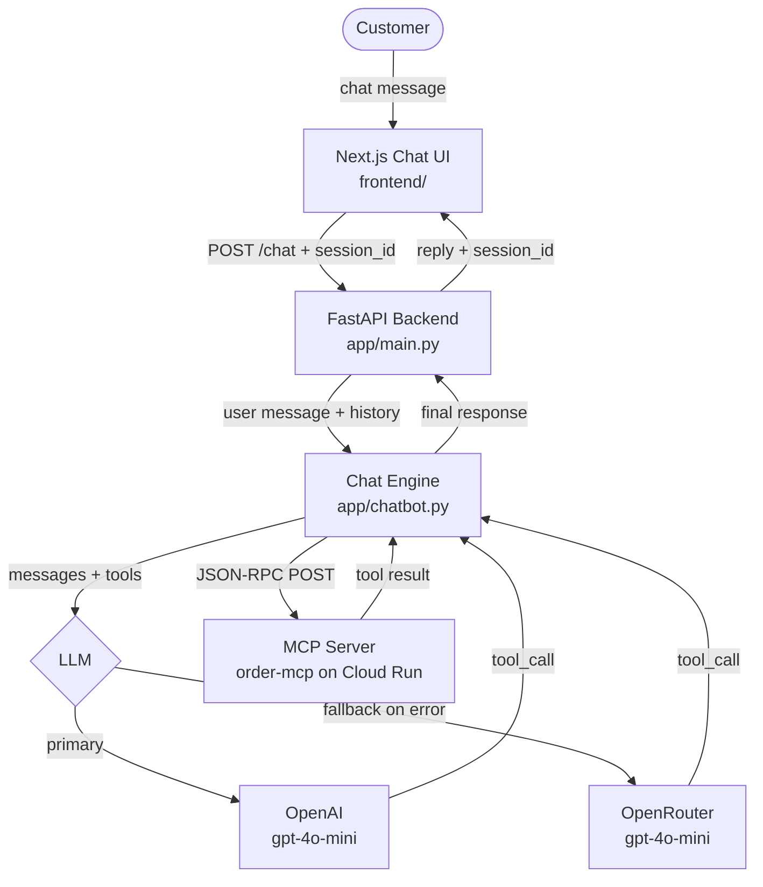
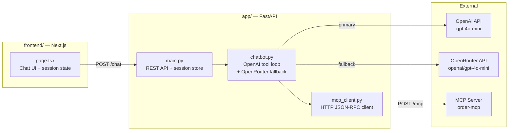
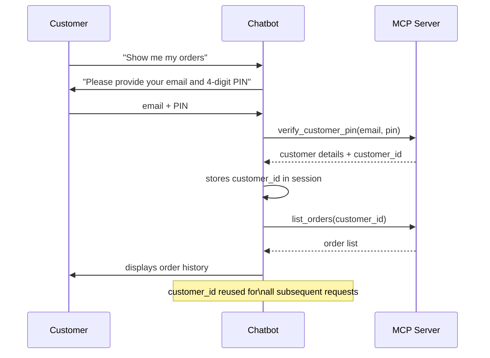
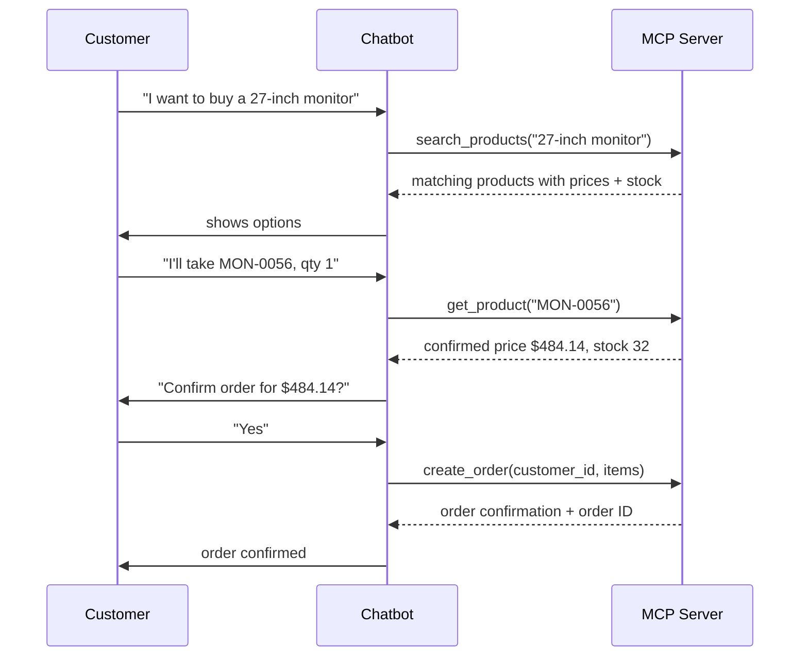
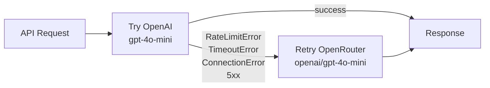
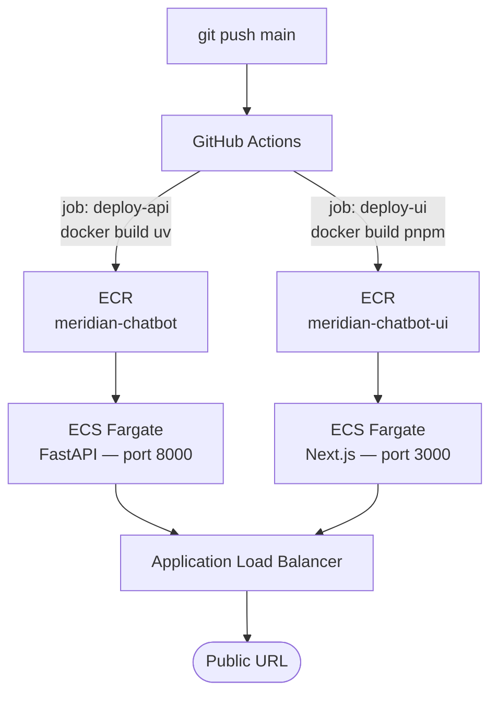

# Meridian Electronics — Customer Support Chatbot

## Business Problem
Meridian Electronics' support team handles all customer inquiries manually via phone and email.
This prototype automates the four most common workflows using an AI chatbot connected to existing
backend systems via MCP — no direct database access required.

---

## High-Level Architecture

---

## Component Breakdown

---

## Authentication Flow

---

## Order Placement Flow

---

## LLM Fallback Strategy

Both providers serve the same `gpt-4o-mini` model. OpenRouter acts as a transparent hot-standby — no prompt or tool definition changes needed.

---

## MCP Tools

| Tool | Auth Required | Purpose |
|------|:---:|---------|
| `search_products` | No | Find products by keyword |
| `list_products` | No | Browse by category |
| `get_product` | No | Price and stock by SKU |
| `verify_customer_pin` | — | Authenticate with email + PIN |
| `get_customer` | Yes | Customer profile |
| `list_orders` | Yes | Order history |
| `get_order` | Yes | Order line items |
| `create_order` | Yes | Place a new order |

---

## CI/CD & Deployment

### Package managers
| Layer | Tool |
|---|---|
| Python backend | `uv` — fast dependency install in Docker |
| Node.js frontend | `pnpm` — fast, strict, deterministic |

### GitHub Actions secrets required
| Secret | Value |
|---|---|
| `AWS_ACCESS_KEY_ID` | aiengineer IAM key |
| `AWS_SECRET_ACCESS_KEY` | aiengineer IAM secret |
| `API_URL` | ALB DNS of the backend e.g. `http://meridian-chatbot-alb-xxx.eu-west-1.elb.amazonaws.com` |

### Infrastructure (Terraform)
| Resource | Purpose |
|---|---|
| ECR (×2) | Docker image registries for API and UI |
| ECS Fargate (×2) | Serverless containers — API and UI services |
| ALB | Single public endpoint, routes to both services |
| IAM | Task execution role + task role (Bedrock-style scoping) |
| CloudWatch | Container logs, 7-day retention |
