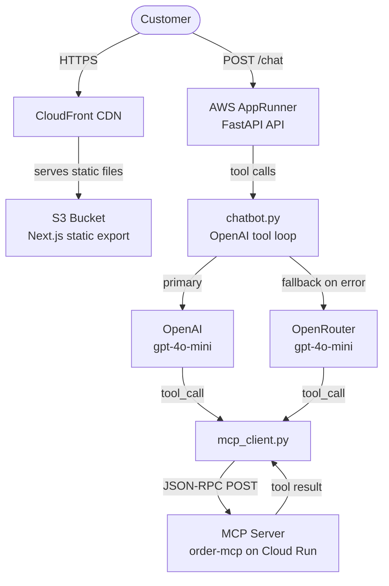
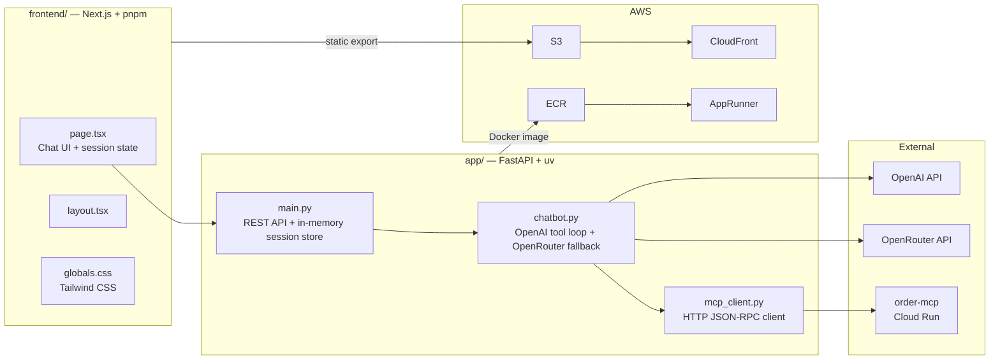
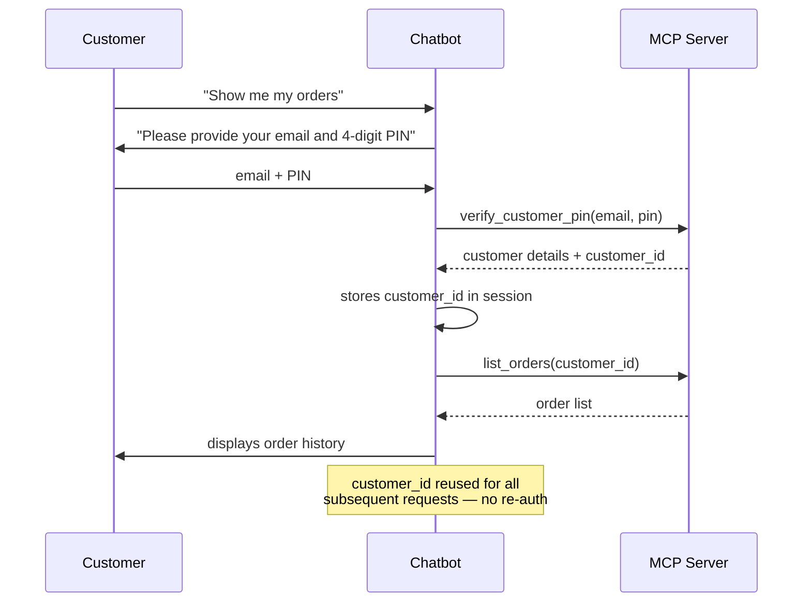
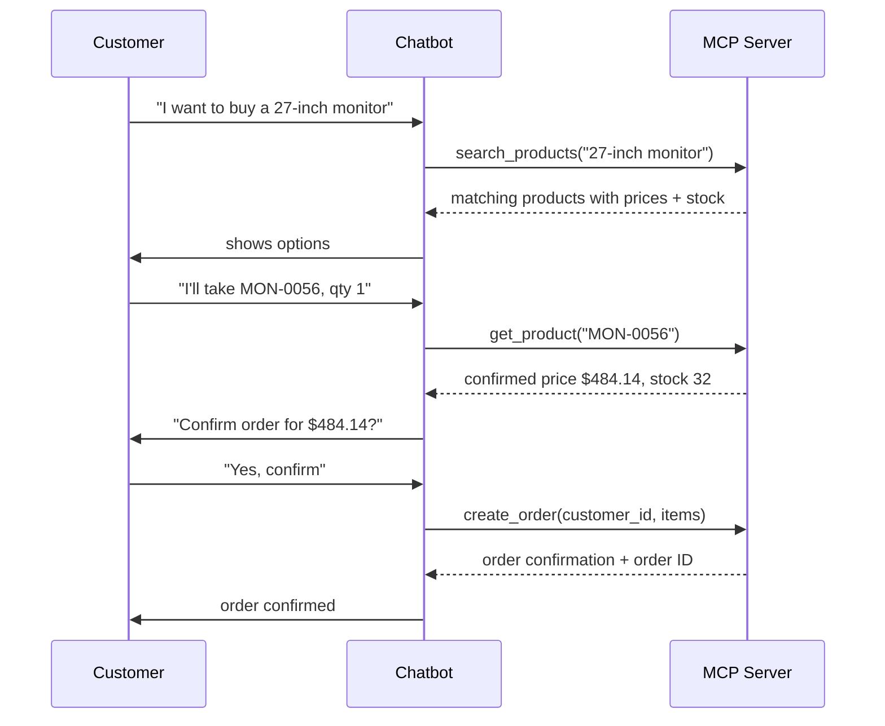
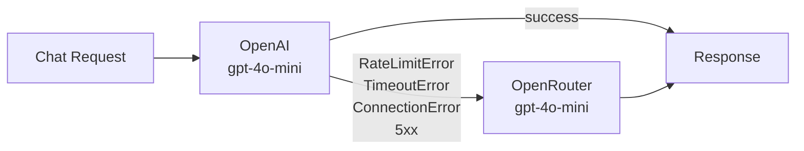
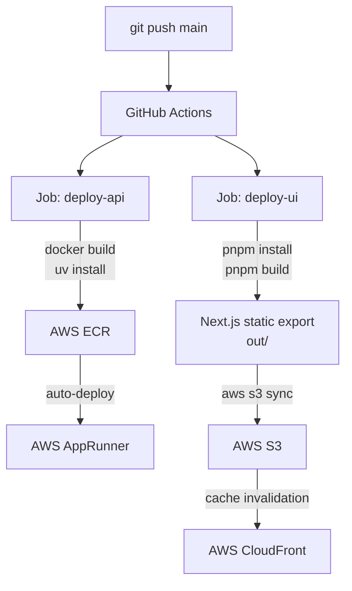

# Meridian Electronics — Customer Support Chatbot

## Business Problem
Meridian Electronics' support team handles all customer inquiries manually via phone and email.
This prototype automates the four most common workflows — product browsing, stock checks,
order history, and order placement — using an AI chatbot connected to existing backend systems
via MCP, with no direct database access.

---

## System Architecture

---

## Component Breakdown

---

## Authentication Flow

---

## Order Placement Flow

---

## LLM Fallback Strategy

Same model on both providers — OpenRouter is a transparent hot-standby with no prompt or tool changes needed.

---

## MCP Tools

| Tool | Auth Required | Purpose |
|------|:---:|---------|
| `search_products` | No | Find products by keyword |
| `list_products` | No | Browse by category |
| `get_product` | No | Price and stock by SKU |
| `verify_customer_pin` | — | Authenticate with email + PIN |
| `get_customer` | Yes | Customer profile |
| `list_orders` | Yes | Order history |
| `get_order` | Yes | Order line items |
| `create_order` | Yes | Place a new order |

---

## CI/CD Pipeline

---

## Infrastructure (Terraform)

| Resource | Purpose |
|---|---|
| **ECR** | Docker image registry for the FastAPI backend |
| **AppRunner** | Serverless container runtime — auto-scales, no ALB or VPC config needed |
| **S3** | Private bucket for Next.js static files |
| **CloudFront** | CDN — serves frontend over HTTPS globally, SPA routing via custom error pages |
| **IAM** | AppRunner access role scoped to ECR pull only |
| **CloudWatch** | Container logs with 7-day retention |

## Package Managers

| Layer | Tool | Why |
|---|---|---|
| Python backend | `uv` | Fast dependency install in Docker |
| Node.js frontend | `pnpm` | Fast, strict, deterministic lockfile |
